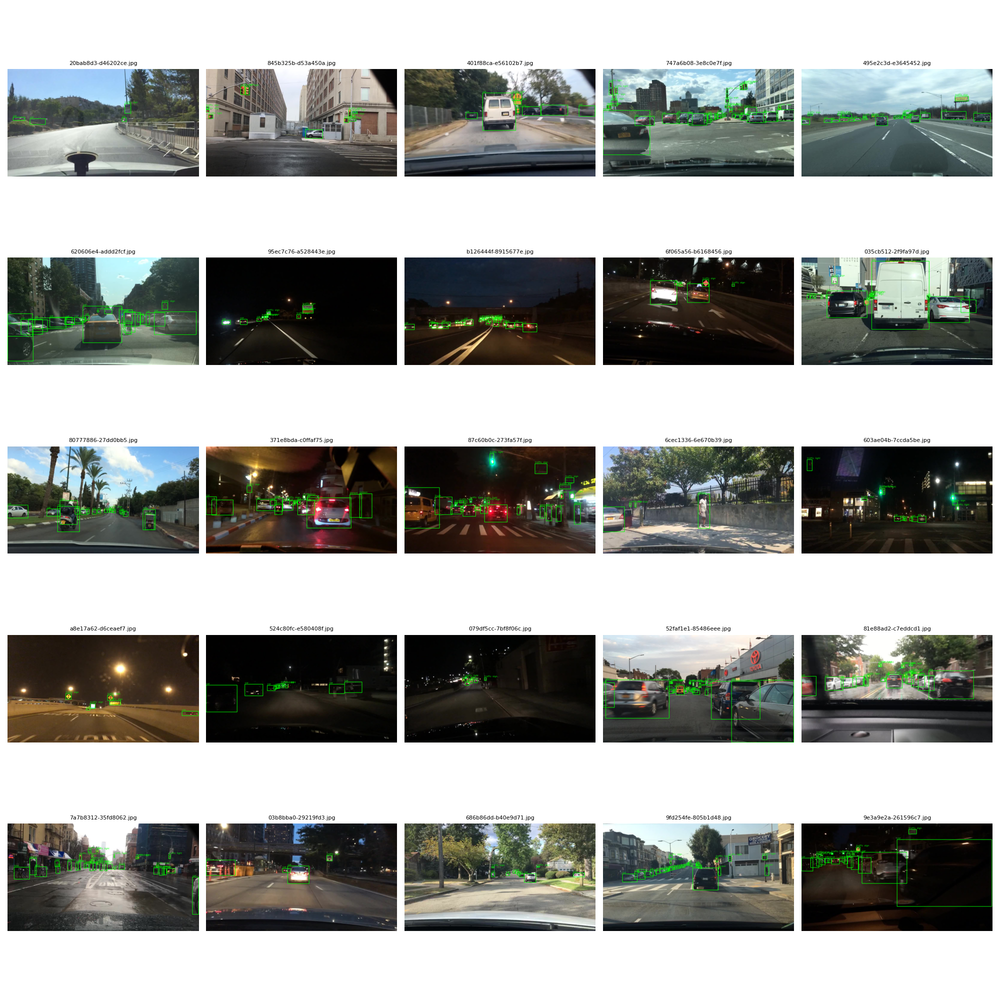
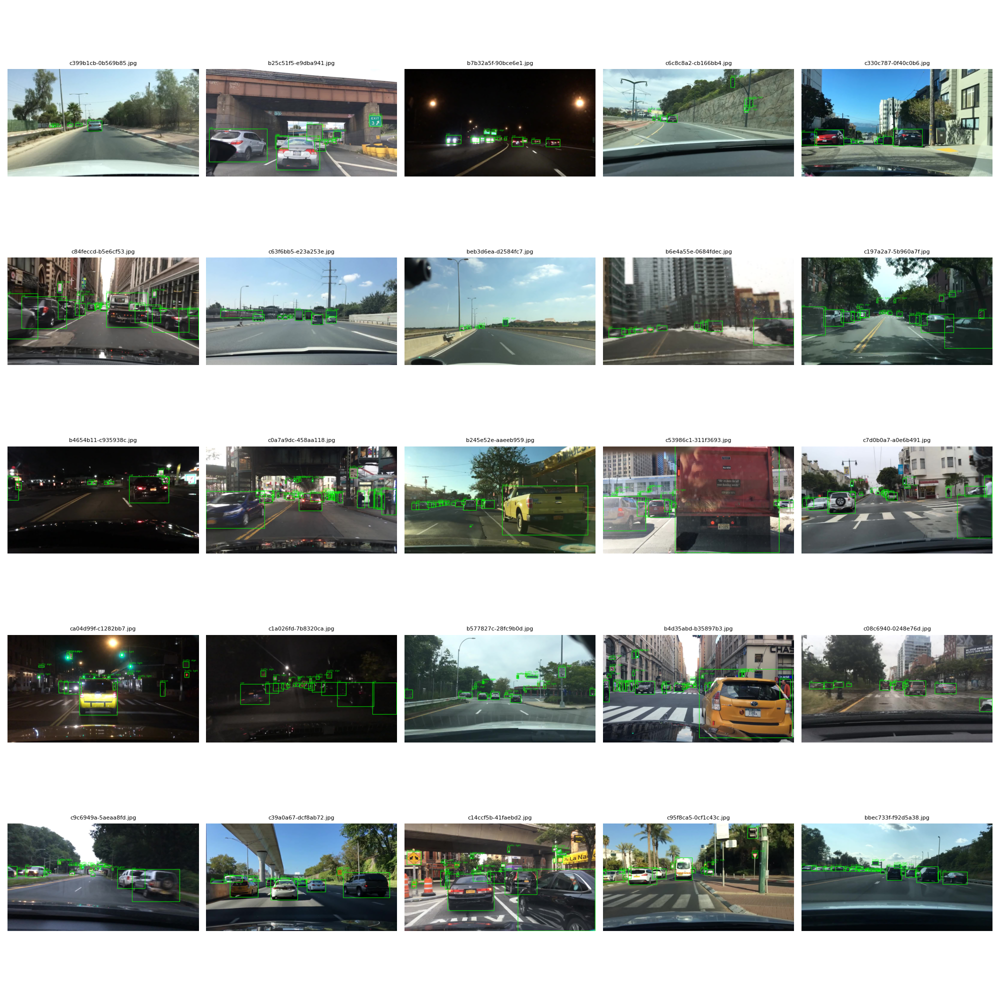
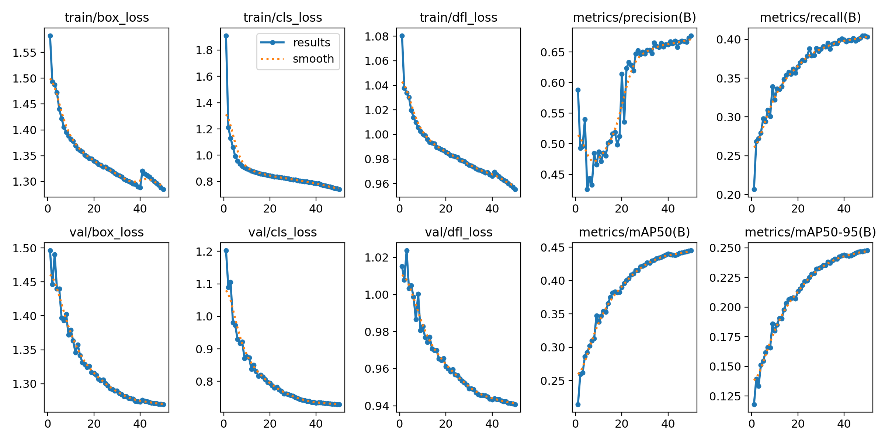
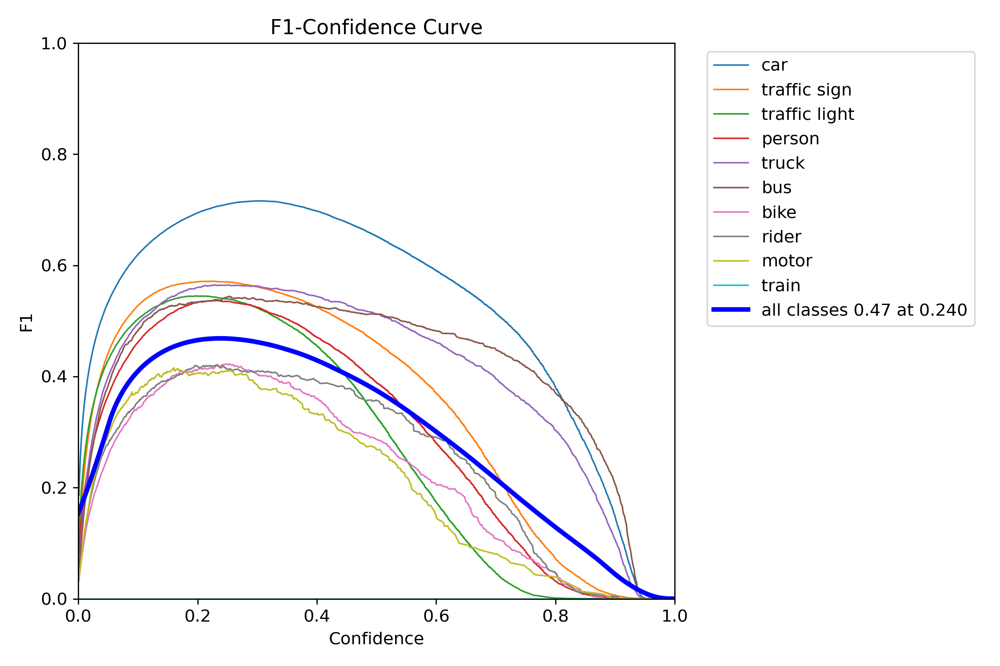
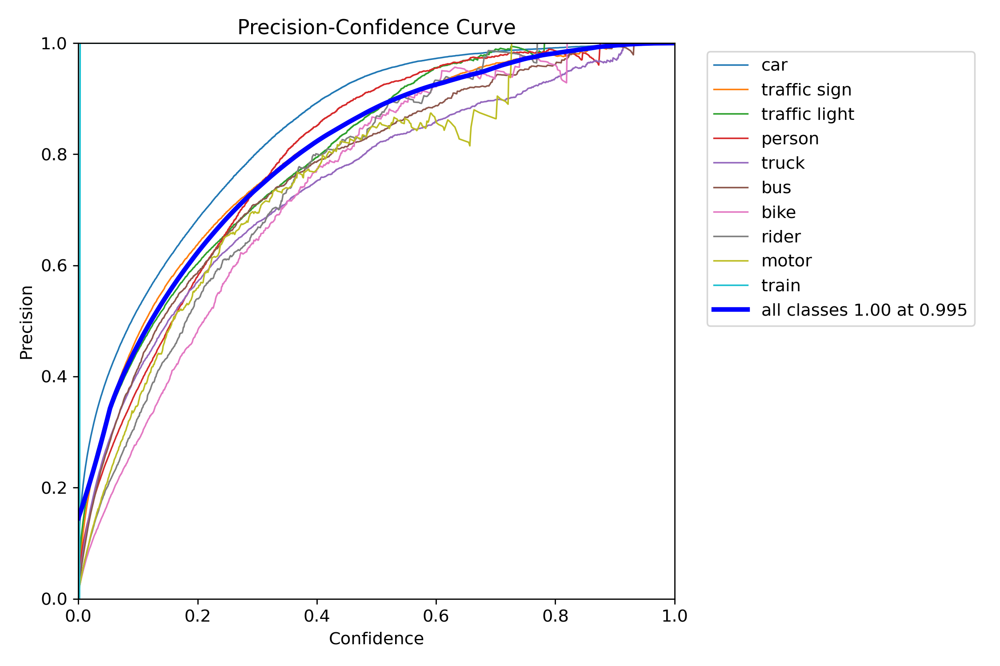
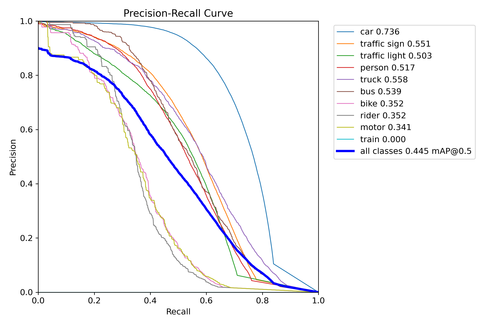
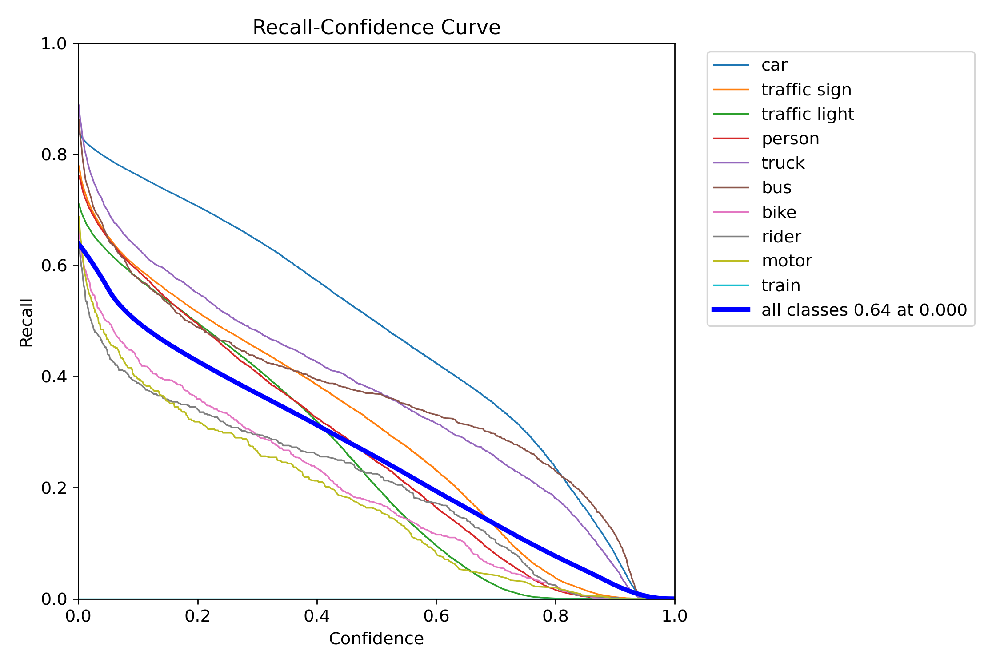
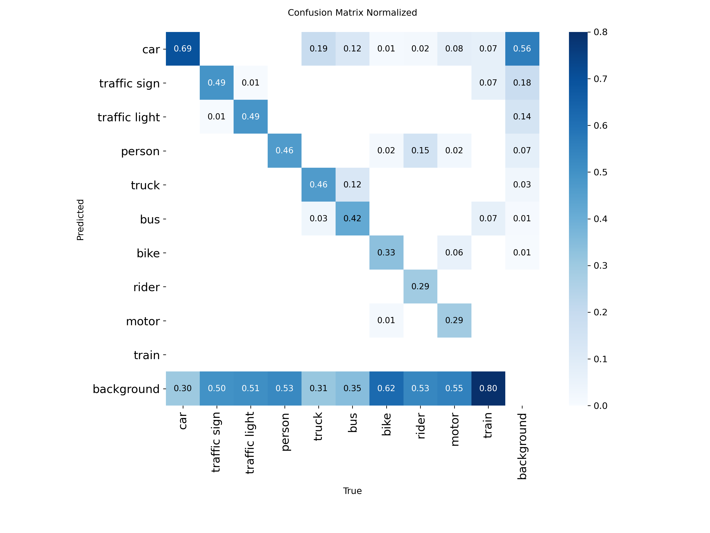
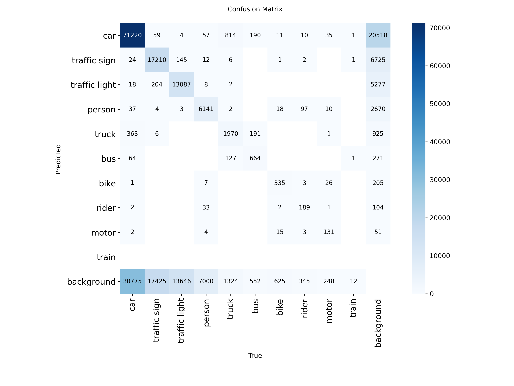

# Analysis of the BDD100K: A Diverse Driving Dataset for Heterogeneous Multitask Learning for Object Detection  
*Mukul Agarwal*  

This repository contains code and resources for analyzing the **BDD100K dataset**, one of the largest and most diverse open driving datasets. The focus is on object detection tasks, with an emphasis on understanding dataset composition, annotation quality, and category-level insights that can inform model training and evaluation.

---

## Data Analysis for Object Detection

### To get the analysis via Docker Container
<pre> docker pull mukulagarwal/data_analysis:latest  </pre>
<pre> docker run -it --rm mukulagarwal/data_analysis:latest </pre> 


The analysis is based on the following dataset components:

### Image Data
- `bdd100k_images_100k/100k/train/`  
- `bdd100k_images_100k/100k/val/`  

### Metadata Files
- `bdd100k_labels_release/bdd100k_labels_images_train.json`  
- `bdd100k_labels_release/bdd100k_labels_images_val.json`  

These metadata files provide object annotations (bounding boxes, categories, attributes) corresponding to each image in the dataset.

---

## Codebase

The following Python scripts are used in this analysis:

- `DataAnalysis.py` – main script for reading and analyzing the dataset.  
- `utilities.py` – helper functions for data parsing and statistics extraction.  

### Output Folders

- `plots/random_grids/` – Random images from **Train** and **Validation** sets with Ground Truth (GT) bounding boxes.  
- `plots/summaries/` – CSV summaries generated from the above function calls.  
- `plots/train/` – Plots generated during execution for the **training set**.  
- `plots/val/` – Plots generated during execution for the **validation set**.  
---

## Main Functionalities

The analysis covers dataset-level statistics, including:

- **Scene** distribution  
- **Weather** conditions  
- **Time of day**  
- **Category** frequencies  
- **Occlusion** levels  
- **Truncation** levels  
- **Number of objects per image**  

**No. of Images in the Train Folder:**  
- **Train images:** 69,863  
- **Validation images:** 10,000  


---

## Example Visualizations

Images showing different scenes with ground-truth bounding boxes:

<p align="center">
  <br>
  <sub>Training Set</sub>
</p>

<p align="center">
  <br>
  <sub>Validation Set</sub>
</p>

### Comments / Analysis

1. The grid of images shows a variety of scenarios in both the **Train** and **Validation** sets, including:  
   - **Highway**  
   - **Urban**  
   - **Night**  
   - **Snow**  
   - **Vehicles**  
   - **Traffic Lights**


# Statistics 
## Category Summary (Train vs Validation)

| Category      | Train Count | Val Count | Train % | Val % | Difference % |
|---------------|-------------|-----------|---------|-------|--------------|
| car           | 713,211     | 102,506   | 55.42   | 55.25 | 0.17         |
| traffic sign  | 239,686     | 34,908    | 18.63   | 18.82 | -0.19        |
| traffic light | 186,117     | 26,885    | 14.46   | 14.49 | -0.03        |
| person        | 91,349      | 13,262    | 7.10    | 7.15  | -0.05        |
| truck         | 29,971      | 4,245     | 2.33    | 2.29  | 0.04         |
| bus           | 11,672      | 1,597     | 0.91    | 0.86  | 0.05         |
| bike          | 7,210       | 1,007     | 0.56    | 0.54  | 0.02         |
| rider         | 4,517       | 649       | 0.35    | 0.35  | 0.00         |
| motor         | 3,002       | 452       | 0.23    | 0.24  | -0.01        |
| train         | 136         | 15        | 0.01    | 0.01  | 0.00         |

Saved CSV: `plots/summaries/category_summary.csv`

<div style="display: flex; text-align: center;">
  <div>
    
  </div>
  <div>
    
  </div>
</div>

## Weather Summary (Train vs Validation)

| Weather       | Train Count | Val Count | Train % | Val % | Difference % |
|---------------|-------------|-----------|---------|-------|--------------|
| clear         | 37,344      | 5,346     | 53.45   | 53.46 | -0.01        |
| overcast      | 8,770       | 1,239     | 12.55   | 12.39 | 0.16         |
| undefined     | 8,119       | 1,157     | 11.62   | 11.57 | 0.05         |
| snowy         | 5,549       | 769       | 7.94    | 7.69  | 0.25         |
| rainy         | 5,070       | 738       | 7.26    | 7.38  | -0.12        |
| partly cloudy | 4,881       | 738       | 6.99    | 7.38  | -0.39        |
| foggy         | 130         | 13        | 0.19    | 0.13  | 0.06         |

Saved CSV: `plots/summaries/weather_summary.csv`
<div style="display: flex; text-align: center;">
  <div>
    
  </div>
  <div>
    

  </div>
</div>

## Scene Summary (Train vs Validation)

| Scene        | Train Count | Val Count | Train % | Val % | Difference % |
|--------------|-------------|-----------|---------|-------|--------------|
| city street  | 43,516      | 6,112     | 62.29   | 61.12 | 1.17         |
| highway      | 17,379      | 2,499     | 24.88   | 24.99 | -0.11        |
| residential  | 8,074       | 1,253     | 11.56   | 12.53 | -0.97        |
| parking lot  | 377         | 49        | 0.54    | 0.49  | 0.05         |
| undefined    | 361         | 53        | 0.52    | 0.53  | -0.01        |
| tunnel       | 129         | 27        | 0.18    | 0.27  | -0.09        |
| gas stations | 27          | 7         | 0.04    | 0.07  | -0.03        |

Saved CSV: `plots/summaries/scene_summary.csv`
<div style="display: flex; text-align: center;">
  <div>
    
  </div>
  <div>
    

  </div>
</div>
---

## Time of Day Summary (Train vs Validation)

| Time of Day | Train Count | Val Count | Train % | Val % | Difference % |
|-------------|-------------|-----------|---------|-------|--------------|
| daytime     | 36,728      | 5,258     | 52.57   | 52.58 | -0.01        |
| night       | 27,971      | 3,929     | 40.04   | 39.29 | 0.75         |
| dawn/dusk   | 5,027       | 778       | 7.20    | 7.78  | -0.58        |
| undefined   | 137         | 35        | 0.20    | 0.35  | -0.15        |

Saved CSV: `plots/summaries/timeofday_summary.csv`
<div style="display: flex; text-align: center;">
  <div>
    
  </div>
  <div>
    

  </div>
</div>

## Bounding Box Statistics (Train vs Validation)

| Dataset | Width Mean | Width Median | Width Std | Height Mean | Height Median | Height Std | Aspect Ratio Mean | Aspect Ratio Median | Aspect Ratio Std | Area Mean  | Area Median | Area Std  |
|---------|------------|--------------|-----------|-------------|---------------|------------|-------------------|---------------------|------------------|------------|-------------|-----------|
| Train   | 56.60      | 28.70        | 75.69     | 49.92       | 29.09         | 61.69      | 1.22              | 1.10                | 0.95             | 0.007353   | 0.000887    | 0.024794  |
| Val     | 56.15      | 28.70        | 74.83     | 49.59       | 28.99         | 61.24      | 1.22              | 1.10                | 0.74             | 0.007247   | 0.000878    | 0.024326  |
Saved CSV: `plots/summaries/bbox_statistics.csv`


## Objects per image Statistics (Train vs Validation)

<div style="display: flex; text-align: center;">
  <div>
    
  </div>
  <div>
    

  </div>
</div>

## Comments/Analysis
**Category Distribution Summary**  
- The dataset is highly **imbalanced**, dominated by **cars** (≈55%), followed by **traffic signs** (≈19%) and **traffic lights** (≈14%).  
- **Persons** form a moderate share (≈7%), while larger vehicles (**trucks, buses**) and two-wheelers (**bike, rider, motor**) collectively contribute <5%.  
- **Trains** are extremely rare (<0.01%).  
- Train and Validation splits are **well aligned**, with percentage differences across categories being **negligible (<0.2%)**, indicating balanced sampling.

**Weather Distribution Summary**  
- The majority of images are captured in **clear weather** (≈53%).  
- Other common conditions include **overcast** (≈12%) and **undefined** weather labels (≈12%).  
- **Snowy, rainy, and partly cloudy** conditions each contribute ~7–8%.  
- **Foggy** scenes are extremely rare (<0.2%).  
- Train and Validation splits are **well balanced**, with differences across weather conditions being **minimal (<0.4%)**.

**Scene Distribution Summary**  
- Most images are from **city streets** (≈62%) and **highways** (≈25%).  
- **Residential areas** contribute around 12%.  
- Rare scenes include **parking lots, tunnels, gas stations, and undefined locations** (<1% each).  
- The Train and Validation splits are **well aligned**, with the largest difference being **city street (+1.17%)** and **residential (-0.97%)**.

**Time of Day Distribution Summary**  
- Majority of images are captured during **daytime (≈53%)**, followed by **night (≈40%)**.  
- **Dawn/dusk** scenes account for ~7–8%.  
- **Undefined cases** are negligible (<0.5%).  
- Train and Validation splits are highly consistent, with the largest variation being **night images (+0.75% in train)**.

**Bounding Box Statistics Summary**  
- Average bounding box sizes are nearly identical between **Train** and **Validation**.  
- **Width** averages around ~56 px and **Height** around ~50 px, with large standard deviations due to object size diversity.  
- **Aspect ratio** is consistent (mean ≈ 1.22, median ≈ 1.1), indicating most objects are roughly square-ish.  
- **Area** distribution shows a very small median (≈0.00088 of image area) compared to the mean, suggesting a few very large objects skew the average.  
- Overall, both splits are well-balanced in bounding box characteristics.  


## Bad Data Analysis

As part of quality checks, we identified **potentially bad bounding boxes** in both Train and Validation splits.  
The following criteria were used to flag problematic annotations:

- **Invalid boxes**: width ≤ 0 or height ≤ 0  
- **Too small boxes**: width < `min_width`, height < `min_height`, or area ratio < `min_area_ratio`  
- **Out-of-bounds**: box coordinates falling outside the image dimensions  
- **Weird aspect ratios**: extreme width-to-height ratios (very elongated boxes)  
- **Duplicate overlaps**: boxes of the same class with IoU > `overlap_iou_thresh`  

This helps in identifying annotation noise that could negatively impact model training and evaluation.

## Sample Visualizations
<table>
  <tr>
    <td>
      <figure>
        
        <figcaption align="center"><sub>Wierd Aspect Ratio</sub></figcaption>
      </figure>
    </td>
    <td>
      <figure>
        
        <figcaption align="center"><sub>Too Small BBox</sub></figcaption>
      </figure>
    </td>
    <td>
      <figure>
        
        <figcaption align="center"><sub>Duplicate Car Overlap</sub></figcaption>
      </figure>
    </td>
  </tr>
  <tr>
    <td>
      <figure>
        
        <figcaption align="center"><sub>Wierd Aspect Ratio Car</sub></figcaption>
      </figure>
    </td>
    <td>
      <figure>
        
        <figcaption align="center"><sub>Wierd Aspect Ratio Bike</sub></figcaption>
      </figure>
    </td>
    <td>
      <figure>
        
        <figcaption align="center"><sub>Wierd Aspect Ratio Traffic Sign</sub></figcaption>
      </figure>
    </td>
  </tr>
  <tr>
    <td>
      <figure>
        
        <figcaption align="center"><sub>Too Small Traffic Light</sub></figcaption>
      </figure>
    </td>
    <td>
      <figure>
        
        <figcaption align="center"><sub>Wierd Aspect Ration Person</sub></figcaption>
      </figure>
    </td>
    <td>
      <figure>
        
        <figcaption align="center"><sub>Wierd Aspect Ration Traffic Light</sub></figcaption>
      </figure>
    </td>
  </tr>
</table>


## Training & Fine-tuning the Model

I used **YOLOv11n** for fine-tuning on the **BDD100K dataset**.  

## YOLO11n Model Details

| Model    | Input Size (pixels) | mAP<sub>50-95</sub> (%) | Speed CPU ONNX (ms) | Speed T4 TensorRT10 (ms) | Params (M) | FLOPs (B) |
|----------|------------------|-------------------------|-------------------|--------------------------|------------|-----------|
| YOLO11n  | 640              | 39.5                    | 56.1 ± 0.8        | 1.5 ± 0.0                | 2.6        | 6.5       |

### Why YOLOv11n?

- **Fast and lightweight** – runs quickly even on limited hardware.  
- **Good accuracy** – detects cars, pedestrians, traffic signs, and other objects well.  
- **Easy to fine-tune** – can use pretrained weights and adapt to BDD100K quickly.  
- **Handles different object sizes** – works well for small and large objects in driving scenes.  
- **Detects multiple classes at once** – perfect for complex street scenes.  
- **Well-supported** – many tutorials, pretrained models, and community help available.

## Converting BDD JSON Data to YOLO Format

I used **BDD2YOLO.py** to convert the BDD100K annotations into YOLO format.  

- This script removes unnecessary metadata.  
- It saves each image’s **path**, **class labels**, and **bounding boxes** as ratios relative to image size.  
- The output is easy to use with the **Ultralytics library** for training and inference.


## Training YOLOv11n on BDD100K

We trained the **YOLOv11n** model using the Ultralytics library with the BDD dataset:

```python
from ultralytics import YOLO

# Load the pretrained YOLOv11n model
model = YOLO("yolo11n.pt")

# Start training
model.train(
    data="BDD/bdd.yaml",   # Path to dataset YAML file
    epochs=50,             # Number of training epochs
    imgsz=640,             # Image size
    batch=64,              # Batch size
    device=0,              # GPU device
    workers=2,             # Number of data loader workers
    single_cls=False,      # Multiple classes
    val=True,              # Use validation set
    mosaic=1.0,            # Mosaic augmentation
    mixup=0.5,             # MixUp augmentation
    copy_paste=0.3,        # Copy-Paste augmentation
    flipud=0.5,            # Vertical flip
    fliplr=0.5,            # Horizontal flip
    translate=0.2,         # Translation augmentation
    scale=0.5              # Scaling augmentation
)

```
<p align="center">
  <br>
  <sub><b>Training and Validation Loss Curves</b></sub>
</p>

1. Trained the model for 50 epochs, with a batch size of 64, tried some augmentation to get a better model. These all are the default options available in the fucntion call.

<p align="center">
  
  
  
</p>
<p align="center">
  <sub><b>F1_curve</b></sub>&nbsp;&nbsp;&nbsp;&nbsp;
  <sub><b>P_curve</b></sub>&nbsp;&nbsp;&nbsp;&nbsp;
  <sub><b>PR_curve</b></sub>
</p>

<p align="center">
  
  
  
</p>
<p align="center">
  <sub><b>R_curve</b></sub>&nbsp;&nbsp;&nbsp;&nbsp;
  <sub><b>Confusion Matrix Normalized</b></sub>&nbsp;&nbsp;&nbsp;&nbsp;
  <sub><b>Confusion Matrix</b></sub>
</p>

## Comments on Model Evaluation on Validation Data While Training

### F1 Curve Analysis
- The F1 curve peaks at a threshold of **0.24**, achieving the highest F1 value of **0.47**.  
- This indicates the best balance between **Precision** and **Recall** for this model.  
- The analysis helps identify the optimal threshold for class-wise performance.

### Precision Curve Analysis
- As expected, **lower thresholds** lead to **lower precision** due to more false positives, while **higher thresholds** improve precision.  
- Observed trends align with expectations:  
  - **Car** performs best, likely due to the higher number of samples.  
  - **Train** detections are mostly missed by the model.  
  - **Bike** and **Motor** show inconsistent precision across thresholds.  

### Recall Curve Analysis
- Recall behaves inversely to precision: **lower thresholds** produce **higher recall** due to more weak detections, whereas **higher thresholds** reduce recall.  
- Observed trends:  
  - **Car, Truck, and Bus** achieve the highest recall, possibly because of more samples and larger bounding boxes.  
  - **Bike, Rider, and Motor** have lower recall due to fewer samples and smaller bounding boxes.

### Normalized Confusion Matrix Analysis
1. **Car:** Detected correctly **69%** of the time; remaining predictions are labeled as **Background**.  
2. **Traffic Sign:** Correctly predicted **49%** of the time; a small fraction misclassified as other classes.  
3. **Rider and Motor:** Low detection rates; **Train** is completely missed.  
4. **Truck, Bus, Bike, Rider, and Motor:** Frequently misclassified as **Car**.  
5. **Train:** Often misclassified as **Bus, Traffic Sign,** or **Car**, likely due to very few training samples.  
6. **Motor, Bike, and Rider:** High confusion among these three classes due to similar features and small sample sizes.

# Detection Metrics by Class
| Class           | Images | Instances | Box(P) | R    | mAP50 | mAP50-95 |
|-----------------|--------|-----------|--------|------|-------|----------|
| **all**         | 10000  | 185,526   | 0.676  | 0.404| 0.445 | 0.248    |
| **car**         | 9,879  | 102,506   | 0.734  | 0.683| 0.736 | 0.455    |
| **traffic sign**| 8,221  | 34,908    | 0.685  | 0.489| 0.552 | 0.283    |
| **traffic light**| 5,653 | 26,885    | 0.650  | 0.464| 0.503 | 0.183    |
| **person**      | 3,220  | 13,262    | 0.644  | 0.459| 0.517 | 0.246    |
| **truck**       | 2,689  | 4,245     | 0.619  | 0.519| 0.559 | 0.402    |
| **bus**         | 1,242  | 1,597     | 0.637  | 0.464| 0.539 | 0.414    |
| **bike**        | 578    | 1,007     | 0.557  | 0.336| 0.351 | 0.168    |
| **rider**       | 515    | 649       | 0.601  | 0.322| 0.356 | 0.169    |
| **motor**       | 334    | 452       | 0.635  | 0.303| 0.341 | 0.163    |
| **train**       | 14     | 15        | 1.000  | 0.000| 0.000 | 0.000    |


## Codebase

The following Python scripts are used in this analysis:

- `inference_metrics.py` – Computes inference and evaluation metrics on the validation dataset.  
- `inference_save_all.py` – Saves all images regardless of the scene, including Ground Truth (GT) and Predicted (Pred) bounding boxes.  
- `inference_save_scenarios.py` – Saves up to 50 images per scenario combination, with GT and Pred bounding boxes. A few sample images are shown below.  

### Output Folders

- `runs/`
  - `runs/compare_preds_gt/images/` – Contains saved images organized by scenario.  
  - `runs/compare_preds_gt/metrics_by_condition.csv` – CSV file containing **F1, Recall, Precision** for different scenario combinations.  
  - `runs/detect/val/` – Contains plots related to **Precision, Recall, and F1 Score**.
# Model Evaluation on Validation Set Across Different Scenarios

This analysis examines the model's performance under various **environmental scenarios**, defined as combinations of:

- **Weather**
- **Scene**
- **Time of Day**

### Example Scenarios
1. Clear : City Street : Dawn/Dusk  
2. Overcast : Gas Station : Daytime  

The goal of this analysis is to **identify corner cases** or specific scenario combinations where the model may struggle or fail completely.  

### Dataset
A CSV file has been prepared that collects metrics for all scenarios, including:

- **F1 Score**
- **Recall**
- **Precision**

This dataset allows for detailed comparison and helps pinpoint conditions that require improvement.

<p align="center">
  
  
  
</p>
<p align="center">
  <sub><b>Snow Highway Night</b></sub>&nbsp;&nbsp;&nbsp;&nbsp;
  <sub><b>Snow Residential Night</b></sub>&nbsp;&nbsp;&nbsp;&nbsp;
  <sub><b>Rainy Highway Night</b></sub>
</p>

<p align="center">
  
  
  
</p>
<p align="center">
  <sub><b>Clear Parking_Lot Night</b></sub>&nbsp;&nbsp;&nbsp;&nbsp;
  <sub><b>Foggy City_Street Night</b></sub>&nbsp;&nbsp;&nbsp;&nbsp;
  <sub><b>Snowy City_Street Night</b></sub>
</p>

## Comments

The images represent scenarios where **some samples fail to detect objects** in the frame.  

- They provide an **overview of the variety of scenes** in the dataset.  
- For each scenario, up to **50 images** have been saved for observation and analysis.  

